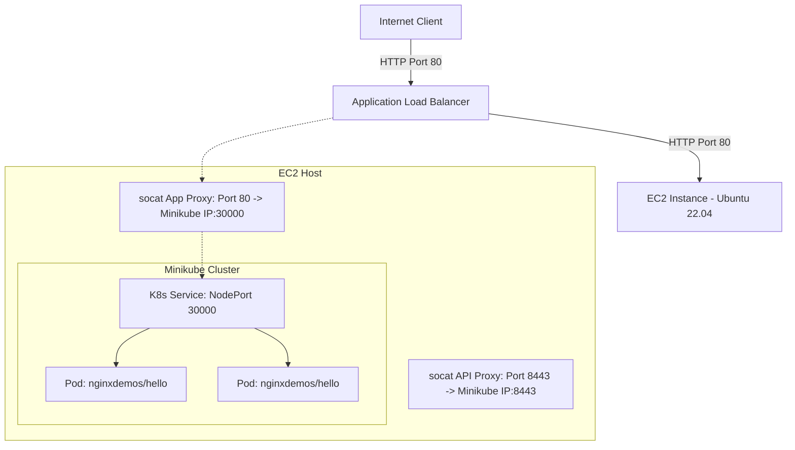

# Kubernetes on AWS - Terraform 1-Click

Dự án này tự động hóa hoàn toàn quá trình khởi tạo một cụm Kubernetes (sử dụng Minikube) trên AWS EC2, triển khai một ứng dụng web đơn giản và expose ứng dụng đó ra ngoài internet thông qua một AWS Application Load Balancer (ALB) bằng cách chạy **một lệnh duy nhất (1-Click)**.

## Sơ đồ Kiến trúc (Architecture Diagram)



---

## Các thành phần chính và cơ chế hoạt động

### 1. Hạ tầng mạng (Network & VPC)
- **VPC** riêng biệt (`10.0.0.0/16`) độc lập với mạng mặc định của AWS để đảm bảo an toàn bảo mật.
- **2 Public Subnets** nằm ở 2 Availability Zones khác nhau trong region để đáp ứng yêu cầu tối thiểu của AWS ALB.
- **Internet Gateway (IGW)** định tuyến traffic từ Internet vào các subnet public.

### 2. AWS Application Load Balancer (ALB)
- Lắng nghe traffic HTTP ở cổng `80` từ Internet.
- **Target Group** trỏ tới địa chỉ IP của con EC2 (Minikube host) trên cổng `80`.
- **ALB Listener** forward traffic từ ALB trực tiếp vào Target Group.

### 3. Minikube trên EC2 Node
- Một instance EC2 size `t3.medium` (2 vCPUs, 4GB RAM, 30GB Disk) chạy hệ điều hành Ubuntu 22.04 LTS.
- Scripts tự động trong `user_data` cài đặt:
  1. Docker CE (làm driver chạy Minikube).
  2. `kubectl` và `minikube`.
  3. Khởi động Minikube với IP public của EC2 được thêm vào SAN (Subject Alternative Name) của TLS certificate để client ngoài internet (ở đây là local máy của bạn) có thể giao tiếp API an toàn:
     `minikube start --driver=docker --apiserver-ips=<EC2-PUBLIC-IP>`
  4. Cài đặt `socat` và đăng ký 2 dịch vụ systemd chạy ngầm tự phục hồi (self-healing):
     - `k8s-api-proxy.service`: Forward cổng `8443` trên EC2 vào cổng `8443` trên container Minikube (API Server).
     - `k8s-app-proxy.service`: Forward cổng `80` trên EC2 vào cổng `30000` trên container Minikube (NodePort của App).

### 4. Cách Wire hai Provider trong Terraform (AWS & Kubernetes)
Đây là phần cốt lõi để đạt được **1-Click Automation**:
1. AWS Provider dựng hạ tầng (VPC, Security Group, EC2 Instance).
2. Khi EC2 vừa được khởi tạo, địa chỉ IP public được cấp. Terraform sẽ chạy data source `external` gọi script PowerShell `get_creds.ps1` chạy local.
3. Script `get_creds.ps1` sẽ thực hiện loop thăm dò (polling) SSH tới EC2 để kiểm tra xem Minikube đã khởi động xong và xuất hiện các file chứng chỉ TLS (`ca.crt`, `client.crt`, `client.key`) hay chưa.
4. Khi các chứng chỉ đã sẵn sàng, script sẽ tải nội dung của chúng về và trả về định dạng JSON cho Terraform.
5. Provider `kubernetes` được thiết lập động (dynamic) bằng cách truyền trực tiếp các chứng chỉ và IP public nhận được vào:
   ```hcl
   provider "kubernetes" {
     host                   = "https://${aws_instance.k8s_node.public_ip}:8443"
     client_certificate     = data.external.kube_creds.result["cert"]
     client_key             = data.external.kube_creds.result["key"]
     cluster_ca_certificate = data.external.kube_creds.result["ca"]
   }
   ```
6. Khi provider `kubernetes` được wire thành công, Terraform sẽ tiến hành tạo `kubernetes_deployment` và `kubernetes_service` trong cùng một phiên chạy `terraform apply`.

---

## Hướng dẫn chạy thử (Quick Start)

### Yêu cầu hệ thống (Prerequisites)
1. Đã đăng nhập AWS SSO qua AWS CLI bằng tài khoản Admin. Đảm bảo profile hoạt động mặc định hoặc khai báo đúng trong file `variables.tf`.
2. Windows PowerShell (đã bật sẵn hỗ trợ SSH client).

### Các bước thực hiện

#### Bước 1: Khởi tạo dự án và tải Terraform local
Chúng tôi đã tải sẵn file chạy `terraform.exe` vào thư mục `./bin` để tránh xung đột hệ thống. Bạn chỉ cần mở terminal tại thư mục gốc và chạy các lệnh dưới đây.

#### Bước 2: Init Terraform
Khởi tạo và tải về các provider cần thiết:
```powershell
.\bin\terraform.exe init
```

#### Bước 3: Apply Terraform (1-Click)
Chạy lệnh apply để tự động tạo hạ tầng AWS, chờ Minikube khởi động, lấy cert và deploy ứng dụng K8s:
```powershell
.\bin\terraform.exe apply -auto-approve
```
*Lưu ý: Quá trình này sẽ mất khoảng 3 - 5 phút để Minikube kéo ảnh Docker và khởi chạy.*

#### Bước 4: Kiểm tra kết quả
Khi kết thúc, Terraform sẽ hiển thị đầu ra gồm:
- `ec2_public_ip`: IP của EC2 host.
- `alb_dns_name`: Địa chỉ DNS của ALB.
- `app_url`: URL truy cập trực tiếp ứng dụng.

Bạn có thể copy `app_url` dán vào trình duyệt để thấy trang web của `nginxdemos/hello` hiển thị đầy đủ thông tin Pod ID chạy trong K8s.

#### Bước 5: Dọn dẹp tài nguyên (Destroy)
Tránh phát sinh chi phí AWS bằng cách dọn dẹp sạch sẽ tài nguyên sau khi test xong:
```powershell
.\bin\terraform.exe destroy -auto-approve
```
